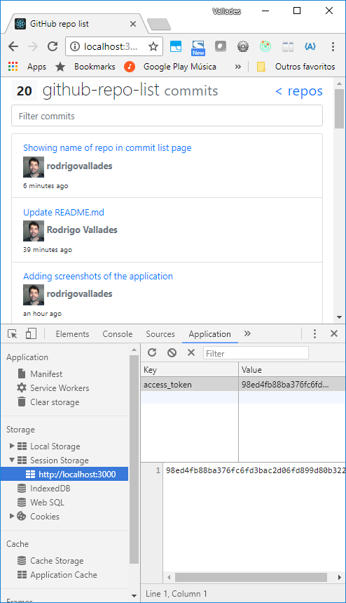

# GitHub OAuth Repo List - Front-end Challenge

## Preview

https://react-github-repo-list.herokuapp.com/

## About me

  - Rodrigo Vallades [rodrigo.vallades@gmail.com]
  - GitHub: https://github.com/rodrigovallades
  - Linkedin: http://lnkd.in/p9wz2A

## Technologies, techniques and best practices used

- [x] React 16 + Redux 5 + React-Router 4
- [x] ES6 (modules, consts, lets, arrow functions, template strings...)
- [x] Persisting OAuth token with sessionStorage
- [x] Tests with Jest + Enzyme
- [x] SCSS
- [x] BEM CSS naming
- [x] Flexbox
- [x] Mobile-first approach
- [x] Bootstrap 4

---
## Getting started

### Prerequisites

Node.js 6+

### Installing
```
npm install
```

### Development (run locally)
```
npm start
```

### Run tests
```
npm test
```
---
## Comments

### You can view the redux store using Redux DevTools Chrome extension


### I prepared a whole suite of tests


### Session storage keeps the Github token active


### The website is responsive, uses flexbox, atomic CSS (BEM) and is mobile-first


---

# Front-end test assignment

## What is expected
An app that connect to the Github API, and list all public repositories from an user, and the last commits for the repositories.

## Tasks

### 1. Connect to github API
Connect to Github API, and list all public repositories from your user. Alternatively use the `reactjs` user.
Create a page that list the public repositories.

### 2. Load commits
After a repository is clicked, the user must be shown a page with the last 20 commits on that repository, also a search field for filtering the commits by the term inserted into the field.

```
Feel free to choose if you are going to use the Rest API or the GraphQL API, and what subset of information you gonna show into each page.
```

## Bonus Tasks
- Use some modern css solution (CSS Modules, Styled-components, etc);
- Endless scrolling for the commits page;
- Make it possible to change the order the repositories are shown (By stars, name, etc);
- Component Library (Storybook.js, Styleguidist, etc);
- Server side rendering.

# Solution
- Use `reactjs`, you can start with a simple `create-react-app` structure and work from there;
- Use ES6+ features and write down in the readme why you used and for what, for at least 2 of them;
- Write unit tests and any other test you may find helpful or important to have;
- Be creative.

# Delivery
- **Don't** fork this project. Create a new repository in your account and send us the URL;
- Create a readme file with the instructions to run the project and the tests, and add any comment that you think is relevant.


Thank you,
Rodrigo
